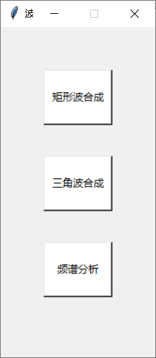

# 波形的合成与分解
信号与系统实验一

## 版本及库依赖
- python版本3.6
- numpy
- matplotlib
- scipy
- tkinter

## 程序架构
- 方波生成模块
- 三角波生成模块
- 频谱分析模块
- GUI界面及显示模块

## 主要函数
### 初始化部分
构造采样频率为1000Hz，时间范围是0-10s的时间序列，根据傅里叶变换公式，运用不同的高次谐波合成方波和三角波。并将19次谐波合成的方波和三角波进行傅里叶变换，得到他们的频谱图。最后将这些数据进行存储。

### show_square函数
显示3次谐波、5次谐波、9次谐波、19次谐波合成的方波信号

由于要求显示的时间范围是0-10s，而信号频率是50Hz，因此显示波形时较为密集，可手动将波形放大

### show_triangle函数
显示3次谐波、5次谐波、9次谐波、19次谐波合成的三角波信号

### wave_analysis函数
显示19次谐波合成的方波和三角波的频谱图

### gui_init函数
初始化GUI界面

## 操作方法
运行Wave.py后会弹出如下的GUI界面：

按下“矩形波合成”按键会显示合成的方波信号。

按下“三角波合成”按键会显示合成的三角波信号。

按下“频谱分析”按键会显示方波和三角波的频谱图。

## 贡献者
- Junpeng Chen ([@bird1and1fish](https://github.com/bird1and1fish))
