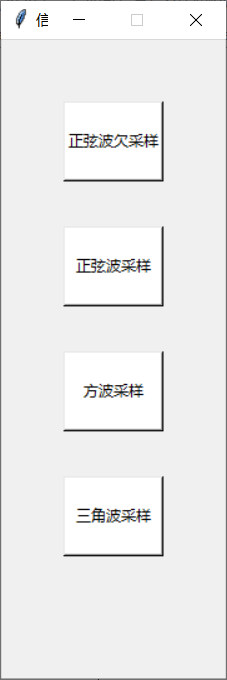

# 信号的抽样和内插
信号与系统实验二

## 版本及库依赖
- python版本3.6
- numpy
- matplotlib
- scipy
- tkinter

## 程序架构
- 巴特沃斯低通滤波器模块
- 正弦波、方波和三角波生成模块
- 采样模块
- 原始信号恢复模块
- 傅里叶变换提取频谱特征模块
- GUI界面及显示模块

## 主要函数
### butter_lowpass和butter_lowpass_filter函数
根据输入的信号、截止频率、采样频率和阶数，对输入信号进行滤波处理。

### 信号产生部分
构造采样频率是10000Hz，时间范围是0-10s的时间序列，根据傅里叶变换公式合成方波和三角波信号。

### sin_sample_under函数
对6Hz的正弦信号进行采样频率为7Hz的欠采样，将采样后的信号通过截止频率为6Hz的巴特沃斯低通滤波器，并通过傅里叶变换得到频谱信息。最后将得到的所有结果进行显示。

### sin_sample函数
对6Hz的正弦信号进行采样频率为25Hz的过采样，将采样后的信号通过截止频率为6Hz巴特沃斯低通滤波器，并通过傅里叶变换得到频谱信息。最后将得到的所有结果进行显示。

### square_sample函数
对6Hz的方波信号进行采样频率为1000Hz过采样，将采样后的信号通过截止频率为500Hz的巴特沃斯低通滤波器，并通过傅里叶变换得到频谱信息。最后将得到的所有结果进行显示。

### triangle_sample函数
对6Hz的三角波信号进行采样频率为1000Hz过采样，将采样后的信号通过截止频率为500Hz的巴特沃斯低通滤波器，并通过傅里叶变换得到频谱信息。最后将得到的所有结果进行显示。

### gui_init函数
初始化GUI界面

## 操作方法
运行Insert.py后会弹出如下的GUI界面：

按下“正弦波欠采样”按键会显示正弦波欠采样的相关结果图

按下“正弦波采样”按键会显示正弦波过采样的相关结果图

按下“方波采样”按键会显示方波过采样的相关结果图

按下“三角波采样”按键会显示三角波过采样的相关结果图

## 贡献者
- Junpeng Chen ([@bird1and1fish](https://github.com/bird1and1fish))
