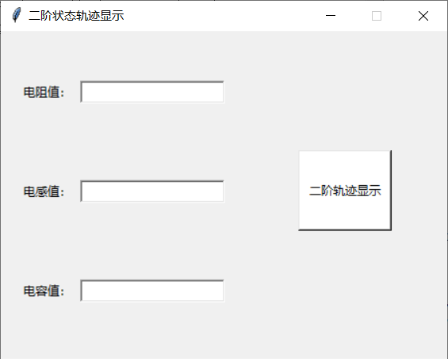

# 二阶状态轨迹的显示
信号与系统实验三

## 版本及库依赖
- python版本3.6
- tkinter
- matplotlib
- numpy
- math

## 程序架构
- 用户输入模块
- 状态变量计算模块
- 状态变量绘制模块
- GUI界面及显示模块

## 主要函数
### is_positive_digit函数
判断用户在文本框中输入的文本是否为数字且是否为非负数，如果不是非负数就弹出错误提示框。

### show_func函数
根据用户输入的正确参数计算电路的状态变量，并根据alpha和w0的值判断电路的阻尼状态，分为无阻尼、欠阻尼、临界阻尼和过阻尼。

### draw_curve函数
根据show_func函数中计算的电路状态变量，绘制出i_L - t， v_c - t, i_L - v_c的图像，并显示在图像窗口中，图像窗口的标题包含了电路的阻尼状态。

### win_init函数
初始化GUI界面

## 操作方法
运行RLC.py后会弹出如下的GUI界面：

正确输入电阻值、电感值、电容值后点击“二阶轨迹显示”按键，即会显示电路的状态曲线和李沙育图形；如果其中一个参数输入不符合规则，则在点击“二阶轨迹显示”按键时会弹出错误窗口。

## 贡献者
- Junpeng Chen ([@bird1and1fish](https://github.com/bird1and1fish))

