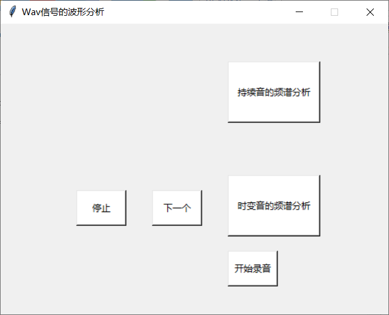

# Wav信号的波形分析
信号与系统实验五

## 版本及库依赖
- python版本3.6
- scipy
- matplotlib
- numpy
- tkinter
- math
- pyaudio
- time
- threading
- wave

## 程序架构
- 录音模块
- 持续音信号读取模块
- 时变音信号读取模块
- fs = 2048的fourier变换模块
- fs = 1024的fourier变换模块
- 反傅里叶变换模块
- 寻找信号中最大正弦分量并绘制的模块
- 时变音信号加窗fourier变换模块
- GUI界面及相关曲线显示模块

## 主要函数
### Recorder类
用于进行实时录音并保存成.wav文件，包含以下函数：

- __init__函数：录音对象初始化
- start函数：开始录音
- __recording函数：进行录音的相关配置
- stop函数：停止录音
- save函数：将录制的音频保存成.wav文件

### record函数
按键响应函数，开始录音

### end_record函数
按键响应函数，停止录音

### stable_sound函数
用于读取持续音信号，提取其中一个1024长度的序列

### changing_sound函数
用于读取时变音信号，并对其连续取1024长度的序列，直到整个数组被取完

### fourier2048函数
对长度为1024的序列进行fs = 2048的傅里叶变换以及fftshift变换，并显示他们的波形

### fourier2048函数
对长度为1024的序列进行fs = 1024的傅里叶变换以及fftshift变换，并显示他们的波形

### ifourier函数
对之前fourier变换后的信号进行反fourier变换，将得到的图与原信号的图相比较，并显示他们的波形

### max_sin函数
获取原信号最大的正弦分量，与原信号相比较，并显示他们的波形。方法就是在频域中提取原信号幅值最大的频率成分，将其余频率置零并进行fourier反变换，即可获得原信号中幅度最大的正弦分量

### stop_wav函数
按键响应函数，停止对时变音信号连续加窗

### next_wav函数
按键响应函数，对时变音信号进行下一次加窗

### win_init函数
初始化GUI界面

## 操作方法
运行RLC.py后会弹出如下的GUI界面：

点击“持续音的频谱分析”按键就会获取持续音信号（（即根目录下的“ring.wav文件”）），显示本实验中与之相关的各种波形图

点击“时变音的频谱分析”会获取时变音信号（即根目录下的“myvoice.wav文件”）并对其0~1024个点进行加窗，显示其fourier变换后的曲线。随后点击“下一个”按键会依次对之后的1024个点进行加窗，同样显示fourier变换后的曲线，直到将整个数组加窗完成，会弹出窗口提示加窗完成。点击“停止”按键后连续加窗停止

点击“开始录音”按键后即可开始录音，并弹出“结束录音”按键，点击“结束录音”按键后即可结束录音，录音文件保存在根目录下的“myvoice.wav”文件

## 贡献者
- Junpeng Chen ([@bird1and1fish](https://github.com/bird1and1fish))